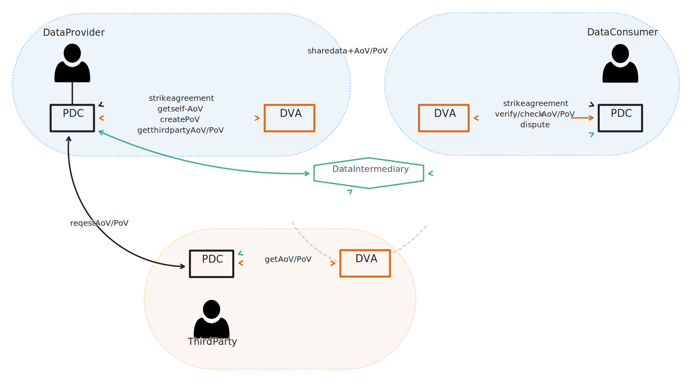

# Data veracity assurance BB – Design Document

The Data Veracity Assurance building block (_DVA_ from now on) allows data exchange participants to agree on and later prove/verify quality requirements or properties of the exchanged data.

For example, if a data producer (abbreviated _P_ from now on) provides simple sensor data to a data consumer (_C_ from now on), DVA can facilitate P to prove (or at least claim) and C to verify that the provided data is credible (eg, temperature values are within a certain range).

DVA requires a **veracity level agreement (VLA)** between the exchange participants.
This agreement is part of the contract and targets a specific data exchange unit (instance).
The VLA defines a number of **veracity objectives** that each describe a **data quality aspect** (eg, _completeness_ or _accuracy_) and an **evaluation scheme** (eg, value is within a numerical range).
The VLA also defines _how_ the evaluation is to be performed (eg, with a certain algorithm or software library).
When the data exchange occurs, in the simplest model, P attaches an attestation (or even a proof) regarding the exchanged data’s quality that C trusts or can verify.

The high-level concepts of the DVA BB have been summarized in the knowledge graph below.
The second graph visualizes a concrete example of using DVA in a use case where xAPI training data is exchanged.

<!-- Hacking a Mermaid flowchart for a knowledge graph for now -->

```mermaid
%%{init: {'theme':'neutral'}}%%

---
title: High-Level Data Veracity Concepts (Knowledge Graph / Metamodel)
---

graph TD
  xchg(["Data\n Exchange"]):::External

  va(["Veracity\n Assurance"]):::Assurance
  aov(["Attestation\n of Veracity"]):::Assurance
  pov(["Proof\n of Veracity"]):::Assurance
  voe(["Veracity Objective Evaluation"]):::Assurance
  eval(["Evaluation"]):::Assurance

  vla(["Veracity\n Level\n Agreement"]):::Agreement
  vo(["Veracity\n Objective"]):::Agreement
  qa(["Quality\n Aspect"]):::Agreement
  es(["Evaluation\n Scheme"]):::Agreement
  crit(["Criterion\n Type"]):::Agreement
  method(["Evaluation\n Method"]):::Agreement

  syntax(["Syntax\n (ISO 8000)"]):::Aspect
  timeliness(["Timeliness\n (ISO 25000)"]):::Aspect
  accuracy(["Accuracy\n (ISO 25000)"]):::Aspect
  completeness(["Completeness\n (ISO 25000)"]):::Aspect
  consistency(["Consistency\n (ISO 25000)"]):::Aspect

  validinvalid(["Valid/\n Invalid"]):::Agreement
  inrange(["In\n Range"]):::Agreement
  greaterless(["Greater Than\n Less Than"]):::Agreement

  vla-- targets exchange -->xchg
  vla-- has objective -->vo
  vo-- targets aspect -->qa
  vo-- can be evaluated using -->es
  es-- has type -->crit
  es-- has method -->method

  syntax & timeliness & accuracy & completeness & consistency-- is a -->qa
  validinvalid & inrange & greaterless-- is a -->crit

  va-- for agreement -->vla
  aov & pov-- is a -->va

  va-- has evaluation -->voe
  voe-- targets objective -->vo
  voe-- has evaluation -->eval

  classDef Agreement fill:#fcdc00,stroke:#000,color:#000
  classDef Aspect fill:#fb4b00,stroke:#000,color:#000
  classDef External fill:#73d8ff,color:#000
  classDef Assurance fill:#a4dd00,stroke:#000,color:#000
  linkStyle default stroke-width:4px
```

```mermaid
%%{init: {'theme':'neutral'}}%%

---
title: Data Veracity Concepts Example (xAPI Learning Traces)
---

graph LR
  xchg(["xAPI Learning\n Traces Exchange"]):::External

  aov(["Attestation\n of Veracity"]):::Assurance
  voe_syn(["Syntax\n Evaluation"]):::Assurance
  voe_rec(["Recency\n Evaluation"]):::Assurance
  eval_syn(["Valid"]):::Assurance
  eval_rec(["3 Days\n Old"]):::Assurance

  vla(["xAPI Learning Trace\n Veracity Level Agreement"]):::Agreement
  vo_syn(["Valid\n Syntax"]):::Agreement
  vo_rec(["Recency"]):::Agreement
  qa_syn(["Syntax"]):::Aspect
  qa_rec(["Timeliness"]):::Aspect
  es_syn(["Syntax\n Checking"]):::Agreement
  es_rec(["Timeliness\n Checking"]):::Agreement
  crit_syn(["Valid/\n Invalid"]):::Agreement
  crit_rec(["Greater Than\nLess Than"]):::Agreement
  method_syn(["Syntax\n Checker"]):::Agreement
  method_rec(["Value\n Comparison"]):::Agreement

  vla-- targets exchange -->xchg

  vla-- has objective -->vo_syn & vo_rec
  
  vo_syn-- targets aspect -->qa_syn
  vo_rec-- targets aspect -->qa_rec
  vo_syn-- can be evaluated using -->es_syn
  vo_rec-- can be evaluated using -->es_rec

  es_syn-- has type -->crit_syn
  es_rec-- has type -->crit_rec
  es_syn-- has method -->method_syn
  es_rec-- has method -->method_rec

  aov-- for agreement -->vla

  aov-- has evaluation -->voe_syn & voe_rec
  voe_syn-- has evaluation -->eval_syn
  voe_rec-- has evaluation -->eval_rec
  voe_syn-- targets objective --->vo_syn
  voe_rec-- targets objective --->vo_rec

  classDef Agreement fill:#fcdc00,stroke:#000,color:#000
  classDef Aspect fill:#fb4b00,stroke:#000,color:#000
  classDef External fill:#73d8ff,color:#000
  classDef Assurance fill:#a4dd00,stroke:#000,color:#000
  linkStyle default stroke-width:4px
```


## Technical Usage Scenarios & Features

### Features/Main Functionalities

Key functionalities:
1. Manage data veracity level agreements (VLAs)
   * more precisely: provide VLA templates (to the _Contract_ BB) for inclusion in new contracts
2. Provide means to…
   * attest to
   * prove
   * verify
   the veracity of exchanged data
3. Log veracity verification results

Additional (not required, value-added) functionalities:
* Potentially enable proving/verifying data properties that are related to further _sensitive_ (eg, due to GDPR) data _without disclosing the sensitive data_
* Decentralized DVA architecture
* Partial attestations or proofs of veracity

### Technical Usage Scenarios

The technical usage scenarios have been summarized in the following UML use case diagram.


* **Fetch Templates:** the _Contract_ component can get the currently available list of VLA templates (which are essentially data quality requirement templates; eg, how many `NaN` values a dataset contains and how to count them) for inclusion in the VLAs of new contracts
* **Manage Templates:** the data space orchestrator has the right to select what templates can be used in the data space.
  The DVA BB provides an initial list of available templates.
  For testing purposes, DVA will provide a simple GUI where templates can be managed (created, removed, edited, etc).
* **Create AoV:** P can create an _attestation_ saying that the shared data complies to the VLA.
  * **Create third-party AoV:** in this case a trusted third party attests to the data’s veracity
  * **Create self-attested AoV:** alternatively, the provider themselves may attest to the data’s veracity
  * You can find more information about AoVs later in this document.
* **Create PoV:** P can also create a _proof_ that the data fulfils the requirements in the VLA.
  * Proofs are different from attestations as they do not require trust from C in either P or a third party.
  * Read more about PoVs later in this document.
* **Send Verdict:** both participants of the data exchange will have a verdict regarding data veracity.
  * Most of the time, P and C will agree in their verdicts (eg, P attests to the veracity of the data, and C trusts P that the data fulfils the VLA).
  * In problematic cases, the parties may disagree.
    For example, P may attest that the data is valid according to the VLA, but C could discover after a re-evaluation (using the methods defined in the contract) that the data quality actually does not meet the requirements.
  * In any case, the two parties’ verdicts are forwarded to the _Contract_ component, which can then handle potential disputes.
* **Verify Verifiable Credential:** both AoVs and PoVs are issued as [verifiable credentials](https://www.w3.org/TR/vc-data-model-2.0/).
  Upon the receipt of an AoV or PoV, C will likely want to verify these documents.
  * **Verify VC Metadata:** this refers to checking of the verifiable credential itself (for a valid cryptograhic signature, schema, etc).
  * **Verify VC Content:** this refers to checking what is encoded in the _subject_ of the verifiable credentials.
    For example, in the context of a PoV, a _proof_ (which could be a small binary object) is included in the file.
    This proof can be directly verified by C.
* **Check AoV:** AoVs are based on trust, but C should still check the attestation ‘document’ itself for validity (a _verifiable credential_).
* **Check PoV:** PoVs are meant to be verified by C.
  If the proof is deemed valid, it is impossible for P to have generated it based on invalid data.
* **Re-Evaluate Data:** In case of an AoV, C may still wish to redo the same calculations and checks that P (or a third party) claims to have done.

#### Templates for Veracity Level Agreements (VLAs)

VLAs describe exactly what data quality P ‘promises’ and/or C expects.
The format and exact contents of VLAs is further detailed later in this document.

It is among the primary functionalities of DVA to facilitate
* _striking_ VLAs (by providing templates for the _Contract_ module)
* _querying_ VLAs for a given data exchange
* _changing_ the terms of VLAs (if this functionality is desired)
* _revoking_ VLAs (if this functionality is desired)

DVA of course also provides the means for P to prove (or attest) and C to verify that the exchanged data fulfils the requirements set by the VLA; see below.

#### Proving, Attestation, and Verification of Veracity

There are chiefly two ways P can offer veracity assurance regarding the exchanged data:
1. By sharing an **Attestation of Veracity (AoV)**
2. By presenting a **Proof of Veracity (PoV)**

The former is obviously the ‘weaker’ option, but depending on the use case, it may be enough, or _proving_ adherence to the VLA may not be possible.

A PoV is a (cryptographic) proof generated by P (or potentially a third party) of the claim ‘the data in question fulfils the requirements in the VLA’.
C can reliably _verify_ these proofs.
Such proofs should be _sound,_ meaning that a cheating P cannot forge a PoV for a piece of data that does not adhere to the VLA’s requirements.

AoVs are simpler because they are non-verifiable (at least not in the sense as PoVs).
Attestations rely on trust – for example, a trusted third party may give their attestation that the data is indeed in line with the VLA requirements.
It is C’s trust in the third party that assures them of the veracity of the data, not actual proof.

An even ‘weaker’ but still noteworthy option is when P attests to the veracity of the data themselves.
At the very least, they _claim_ that the data is in line with the VLA and can be later held to their claim if C discovers otherwise.

Nonetheless, it may be in C’s best interest to ensure that the attester is being honest.
To this end, C can perform the same (pre-agreed) measurements and checks on the data as the attester claims to have done and compare the results.

Finally, there may not even be a proof or attestation, merely a direct check of the data’s veracity by C.

DVA defines what proofs and attestations are (see later in this document) and provides means to generate PoVs, AoVs, and to verify veracity.

#### Logging of Results

DVA also keeps track of veracity verification results for traceability purposes.


## Requirements

* **`[BB_08__01]`** DVA MUST define schemata for VLAs
* **`[BB_08__02]`** DVA MUST provide VLA templates
* **`[BB_08__03]`** DVA SHOULD support editing available VLA templates
* **`[BB_08__04]`** DVA MUST support striking VLAs
* **`[BB_08__05]`** DVA MUST provide multiple veracity assurance methods
* **`[BB_08__06]`** DVA MUST support veracity attestation (ie, either P or a third party attests that veracity requirements are met)
* **`[BB_08__07]`** DVA SHOULD support veracity self-attestation
* **`[BB_08__08]`** DVA SHOULD support third-party veracity attestation
* **`[BB_08__09]`** DVA SHOULD support provider-proven veracity
* **`[BB_08__10]`** DVA SHOULD support consumer-verified veracity
* **`[BB_08__11]`** DVA MUST interface with the Contract service
* **`[BB_08__12]`** DVA MUST interface with the Dataspace Connector
* **`[BB_08__13]`** DVA MUST log verification results


## Integrations

### Direct Integrations with Other BBs

* As VLAs are similar to contracts (or will become part of the contracts), DVA will have interactions with the **Contract** component


### Integrations via Connector

* DVA will directly integrate with the **Dataspace Connector** itself to extend data exchange flows with veracity assurance steps
* DVA will also have integrations with the **Data Value Chain Tracker** BB
  * The _value_ is strongly related to the quality of the data assured by DVA


## Relevant Standards

### Data Format Standards

* VLAs will be encoded in [YAML](https://yaml.org/).
* In all likelihood, DVA will parse and/or serialize into [JSON](https://www.json.org/) or [JSON-LD](https://json-ld.org/) files for interoperability.
* For configuration, DVA will use [TOML](https://toml.io/en/).

### Other Standards

There are ISO standards that define data-quality-related concepts:
* [ISO 8000-61:2016](https://www.iso.org/standard/63086.html) – Data Quality – Part 61: Data quality management: Process reference model
* [ISO/IEC 25000:2014](https://www.iso.org/standard/64764.html) – Systems and software engineering – Systems and software Quality Requirements and Evaluation (SQuaRE)

Other possibly relevant standards and specifications:
* [Data Contracts](https://datacontract.com/), which are very similar to VLAs, have a [standard](https://github.com/bitol-io/open-data-contract-standard)

PoVs and AoVs are planned to be manifested as [W3C _verifiable credentials_ (VCs)](https://www.w3.org/TR/vc-overview/):
* [W3C Verifiable Credentials Data Model v2.0](https://www.w3.org/TR/vc-data-model-2.0/)

### Mapping to Data Space Reference Architecture Models

**DSSC:** see the [Value-Added Services](https://dssc.eu/space/BVE/357076468/Value-Added+Services) building block.

**IDS RAM:** see [4.3.6 Data Quality](https://docs.internationaldataspaces.org/ids-knowledgebase/v/ids-ram-4/perspectives-of-the-reference-architecture-model/4_perspectives/4_3_governance_perspective/4_3_7_data_quality) in the Governance Perspective.


## Input / Output Data

### Data Veracity Level Agreements (VLAs)

Initial mockup VLAs based on [data contracts](https://github.com/bitol-io/open-data-contract-standard):

```yaml
---
id: urn:vla:example:vrtraces
meta:
  title: VR Learning Traces VLA Example
  version: 0.1.0
  description: |
    A simple Veracity Level Agreement (VLA) example based on the
    VR Learning Traces building block.
  exchange: cdef77c9-4016-45bb-868d-6f014e17ed2d


models:
  trace:
    description: A VR learning trace
    type: xapi
    xapi_extensions:
      - http://example.com/exercises/b9e16535-4fc9-4c66-ac87-3ad7ce515f5c/sensors/score


objectives:

  - name: xapi_syntax
    description: Data is a valid xAPI JSON file
    aspect: syntax
    evaluation:
      method:
        id: syntax_check
        args:
          checker: xapi
      type: valid_invalid

  - name: 1w_freshness
    description: Learning trace is not too old
    aspect: timeliness
    evaluation:
      method:
        id: timestamp_comparison
        args:
          timestamp: xapi_timestamp
          within: 1w
      type: in_range

  - name: new_user
    description: No data has been supplied about this actor in the past
    aspect: uniqueness
    evaluation:
      method:
        id: uniqueness_check
        args:
          target: actor.id
      type: valid_invalid
```

```yaml
---
id: urn:vla:example:moodle
meta:
  title: Moodle Learning Traces VLA Example
  version: 0.1.0
  description: |
    A simple Veracity Level Agreement (VLA) example for Moodle-like xAPI
    data
  exchange: bb54352d-3da4-4b6d-a4db-3639003f5f99


models:
  trace:
    description: xAPI trace
    type: xapi


objectives:

  - name: is_dases
    description: Trace is within the subset defined by Gaia-X DaSES
    aspect: schema
    evaluation:
      method:
        id: xapi_schema_dases
      type: valid_invalid
```

### Attestations of Veracity (AoVs)

AoVs (and PoVs) are envisioned as verifiable credentials.
The information graph that summarizes the contents of these credentials can be seen below.


For AoVs, specifying concrete evaluation results is optional.
The important elements of an attestation are its issuer and the identifiers of the relevant data exchange (and contract).

For PoVs, the _proof_ is a crucial element of the credential.


## Architecture

### High-Level Architecture



### Internal Software Architecture

<!-- Abusing Mermaid's flowcharts... -->


## Dynamic Behaviour

The sequence diagrams below describe possible DVA additions to the basic Connector flows.

_(To be discussed with Félix)_


## Configuration & Deployment Settings

One of the main questions is how many DVA instances there are in a data space.
For example, there may be a single centralized DVA instance that can be contacted by the connectors during data exchange.
However, a more advantageous approach is to have a decentralized configuration with several DVA instances.
There may be a DVA instance at the participating organizations – eg, P can use their own DVA instance to generate the proof or attestation that will be passed together with the data to C.
Likewise, C may use their ‘local’ DVA instance to perform the verification.

Going further, all the DVA instances may form a blockchain.
Using privacy-preserving features (such as private data in Hyperledger Fabric) it is possible for only the data exchange participants to see the proofs generated, while other data space participants merely see a record of the proof having been generated on the blockchain (as a commitment).


## Third Party Components & Licenses

_TBD_


## Implementation Details

_TBD_


## OpenAPI Specification

The current specification can be found in [`spec/openapi.yaml`](https://github.com/Prometheus-X-association/data-veracity/blob/main/spec/openapi.yaml).


## Test Specification

### Test Plan

The primary objective of testing will be to validate the correct handling of exchanged data compliant and non-compliant with the quality aspects established in the VLA.
Several data examples (including correct and incorrect samples) will be used for these tests.
Various data quality aspects will be targeted and case studies will be conducted using different data types used in the main project use cases, like VR traces (xAPI), Moodle learning traces (xAPI), and skills (ontology/terminology).

The integration with the _Dataspace Connector_ component will be tested thoroughy to verify that the necessary interactions are indeed possible and that error cases are handled properly (eg, when no data is received during a data exchange or data _is_ received but without a PoV/AoV even though it would be required).

While DVA will not directly integrate with the _Contract_ component, it should be tested that DVA can recognize VLA fragments defined in the contracts and that it is possible to extend existing contracts with VLA fragments.
In the end, this functionality will be provided by (or at least _via_) the _Catalogue,_ not this BB.

Furthermore, interactions with other components, such as the _Data Value Chain Tracker (DVCT)_ will be validated through testing, as these potentially involve new interactions, protocols, and interfaces.

The DVA BB test acceptance critieria are, informally, and without striving for completeness:
* VLAs can be struck and parsed from contracts.
* DVA correctly handles data fulfilling the criteria in the corresponding VLA as well as data that is non-compliant.
* DVA can successfully communicate with the _Dataspace Connector_ and be a part of the data exchange flow.
* AoVs and PoVs can be created via DVA.
* No PoVs can be created for data that does not fulfil the VLA.

### Internal Unit Tests


### Component-level Testing


## Abbreviations Used

| Abbreviation | Expansion |
| :--- | :--- |
| DVA | data veracity assurance building block |
| VLA | veracity level agreement |
| P | data producer |
| C | data consumer |
| PoV | proof of veracity |
| AoV | attestation of veracity |
