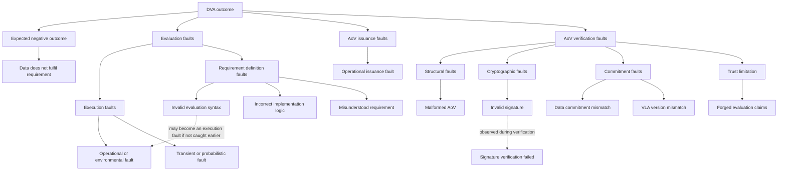

# DVA Failure Model

## Purpose

This document describes negative outcomes, faults, and trust limitations across VLA creation, data evaluation, AoV issuance, and AoV verification. It gives each case a stable identifier and records where it can be detected, who needs the feedback, and what they can do next.

A failed requirement is not automatically a system error. If evaluation completes correctly and the data does not satisfy the requirement, the system has produced a valid negative result. An error or indeterminate result means the system could not reach a trustworthy conclusion.

## Terminology

| Outcome | Meaning |
|---|---|
| `PASS` | The operation completed and the requirement or verification passed. |
| `FAIL` | Evaluation completed correctly, but the data did not satisfy a requirement. |
| `INDETERMINATE` | The system could not produce a trustworthy conclusion. |
| `ERROR` | A technical operation could not complete or its input was unusable. |
| `TRUST_LIMITATION` | The problem is possible, but normal verification does not detect it. |

Detectability is recorded as `AUTOMATIC`, `PARTIAL`, `MANUAL`, or `NOT_DETECTABLE`.

Feedback recipients are the VLA author, data provider, data consumer, operator, or security operator. A recipient identifies who can act on the result. It does not imply that a notification mechanism already exists.

## Failure Hierarchy

```text
DVA outcome
├── Expected negative outcome
│   └── DATA_REQUIREMENT_NOT_MET
├── Evaluation faults
│   ├── Execution faults
│   │   ├── EVALUATION_OPERATIONAL_FAULT
│   │   └── EVALUATION_TRANSIENT_FAULT
│   └── Requirement-definition faults
│       ├── EVALUATION_LOGIC_SYNTAX_INVALID
│       ├── EVALUATION_LOGIC_INCORRECT
│       └── REQUIREMENT_MISUNDERSTOOD
├── AoV issuance faults
│   └── AOV_ISSUANCE_OPERATIONAL_FAULT
└── AoV verification faults
    ├── Structural
    │   └── AOV_MALFORMED
    ├── Cryptographic
    │   ├── AOV_SIGNATURE_INVALID
    │   └── SIGNATURE_VERIFICATION_FAILED
    ├── Commitment
    │   ├── DATA_COMMITMENT_MISMATCH
    │   └── VLA_COMMITMENT_MISMATCH
    └── Trust limitation
        └── AOV_CLAIMS_FORGED
```



## Failure Catalog

### `DATA_REQUIREMENT_NOT_MET`

- **Stage:** Evaluation
- **Category:** Expected negative outcome
- **Outcome:** `FAIL`
- **Meaning:** Evaluation completed correctly, but at least one requirement was not satisfied. For example, the VLA requires 100 records and the data contains 50.
- **Detectability:** `AUTOMATIC`, from a completed evaluation result.
- **Feedback:** Provider dashboard and evaluation details, addressed to the data provider.
- **Action:** Inspect the failed requirement and evidence. Correct the data, or review the requirement with the consumer if it does not express the intended agreement.
- **Retry:** Do not retry unchanged data. Retry after the data or agreement changes.

### `EVALUATION_OPERATIONAL_FAULT`

- **Stage:** Evaluation
- **Category:** Execution fault
- **Outcome:** `INDETERMINATE`
- **Meaning:** The evaluation could not run because its engine, dependency, process, memory, permissions, or environment failed. This says nothing about whether the data satisfies the requirement.
- **Detectability:** `AUTOMATIC`, when the engine raises an execution or environment error.
- **Feedback:** Provider dashboard for the request result and component logs for diagnosis, addressed to the operator.
- **Action:** Restore the evaluator or dependency, then run the evaluation again. Preserve the request identifier and technical error for diagnosis.
- **Retry:** Retry only after the environment is healthy or for a clearly temporary service failure.

### `EVALUATION_TRANSIENT_FAULT`

- **Stage:** Evaluation
- **Category:** Execution fault
- **Parent:** `EVALUATION_OPERATIONAL_FAULT`
- **Outcome:** `INDETERMINATE`
- **Meaning:** A nondeterministic evaluation may give a different result on another run. Examples include an unrepresentative sample or an inconsistent LLM-based check.
- **Detectability:** `PARTIAL`. One result alone does not prove that it is transient. The evaluator must declare nondeterminism or repeated runs must disagree.
- **Feedback:** Evaluation details, addressed to the provider and operator.
- **Action:** Repeat the check under controlled conditions and compare the outcomes. Record the sampling method, sample size, random seed when available, model identifier, model parameters, and attempt number.
- **Retry:** Allow up to three controlled attempts by default for requirements marked as nondeterministic. Keep the limit configurable.

### `EVALUATION_LOGIC_SYNTAX_INVALID`

- **Stage:** VLA creation
- **Category:** Requirement-definition fault
- **Outcome:** `ERROR`
- **Meaning:** A rendered JQ expression, JSON Schema, or Great Expectations definition cannot be parsed or compiled.
- **Detectability:** `AUTOMATIC`, by validating the rendered implementation before it is added to a VLA.
- **Feedback:** VLA Manager editor or requirement dialog, addressed to the VLA author.
- **Action:** Block the requirement, preserve the form values, show the engine error, and let the author correct the implementation or template parameters.
- **Retry:** Validate again after correction. Repeating unchanged invalid logic cannot help.
- **Relationship:** If this is not caught during VLA creation, it can later appear as `EVALUATION_OPERATIONAL_FAULT` during evaluation.

### `EVALUATION_LOGIC_INCORRECT`

- **Stage:** VLA creation and review
- **Category:** Requirement-definition fault
- **Outcome:** `TRUST_LIMITATION`
- **Meaning:** The implementation is syntactically valid but checks the wrong condition. For example, it uses the wrong relational operator.
- **Detectability:** `MANUAL`. Syntax validation cannot prove that executable logic matches the author's intention.
- **Feedback:** VLA Manager testing workspace, addressed to the VLA author and reviewer.
- **Action:** Execute a known passing example and a known failing example, inspect the rendered implementation, and review the result. Warn when both examples produce the same outcome.
- **Retry:** Re-run tests after changing the logic or examples.

### `REQUIREMENT_MISUNDERSTOOD`

- **Stage:** VLA creation and agreement review
- **Category:** Requirement-definition fault
- **Outcome:** `TRUST_LIMITATION`
- **Meaning:** The implementation correctly represents one interpretation, but that interpretation is not the business requirement the parties intended.
- **Detectability:** `MANUAL`. The system cannot infer the parties' intended meaning from executable logic alone.
- **Feedback:** VLA Manager authoring and review interface, addressed to the VLA author and agreement participants.
- **Action:** Review plain-language intent, parameters, and representative passing and failing examples before accepting the VLA.
- **Retry:** Revise the requirement and repeat the review.

### `AOV_ISSUANCE_OPERATIONAL_FAULT`

- **Stage:** AoV issuance
- **Category:** Issuance fault
- **Outcome:** `ERROR`
- **Meaning:** Evaluation may have completed, but the VC Manager could not create, sign, or persist the AoV. Possible causes include unavailable key material, an unsupported cryptographic operation, or service failure.
- **Detectability:** `AUTOMATIC`, from the issuance response or exception.
- **Feedback:** Provider dashboard and VC Manager logs, addressed to the operator.
- **Action:** Check VC Manager health, signing key configuration, cryptographic support, and persistence. Do not report an AoV as issued until issuance and required persistence complete.
- **Retry:** Retry only when issuance did not complete and the failure is safe to repeat.

### `AOV_MALFORMED`

- **Stage:** AoV verification
- **Category:** Structural fault
- **Outcome:** `ERROR`
- **Meaning:** The received AoV cannot be parsed or is missing required structure. Examples include a damaged compact JWS or invalid JSON payload.
- **Detectability:** `AUTOMATIC`, during structural parsing before signature verification.
- **Feedback:** Consumer verification dashboard, addressed to the data consumer.
- **Action:** Reject the AoV and request a replacement. Keep safe structural evidence for troubleshooting without exposing secrets.
- **Retry:** Do not retry the same malformed value.

### `AOV_SIGNATURE_INVALID`

- **Stage:** AoV verification
- **Category:** Cryptographic fault
- **Outcome:** `ERROR`
- **Meaning:** The AoV signature is not valid for the asserted issuer or accepted key. The cause may be corruption, an untrusted key, an unsupported algorithm, or forgery.
- **Detectability:** `AUTOMATIC`, through cryptographic verification and issuer trust checks.
- **Feedback:** Consumer verification dashboard, addressed to the consumer and operator. Repeated suspicious failures should reach a security operator.
- **Action:** Reject the AoV. Check issuer trust configuration and investigate whether the value was damaged, signed by the wrong key, or deliberately forged.
- **Retry:** Do not repeatedly verify an unchanged invalid AoV.
- **Relationship:** `SIGNATURE_VERIFICATION_FAILED` is the verification event through which this underlying problem is observed.

### `SIGNATURE_VERIFICATION_FAILED`

- **Stage:** AoV verification
- **Category:** Cryptographic verification event
- **Outcome:** `ERROR`
- **Meaning:** The consumer's signature verification step returned a negative result.
- **Detectability:** `AUTOMATIC`.
- **Feedback:** Consumer verification history and dashboard, addressed to the consumer and operator.
- **Action:** Treat the AoV as untrusted and inspect the more specific reason, such as malformed input, untrusted issuer, unsupported algorithm, or invalid signature.
- **Retry:** Follow the underlying reason. A repeated check of unchanged input normally cannot help.
- **Related failure:** `AOV_SIGNATURE_INVALID`.

### `DATA_COMMITMENT_MISMATCH`

- **Stage:** AoV verification
- **Category:** Commitment fault
- **Outcome:** `ERROR`
- **Meaning:** The hash committed in the AoV does not match the received data. The data may have changed, been mixed with another exchange, or been maliciously replaced.
- **Detectability:** `AUTOMATIC` after canonical hashing and a signed data commitment are implemented.
- **Feedback:** Consumer verification dashboard, addressed to the consumer and operator. Notify the provider when an exchange mismatch needs investigation.
- **Action:** Reject the AoV for this data. Compare exchange identifiers and hashing rules, then investigate mutation or routing mix-ups.
- **Retry:** Recomputing the same hash is useful only to confirm a local processing error. A replacement AoV or correct data is otherwise required.

### `VLA_COMMITMENT_MISMATCH`

- **Stage:** AoV verification
- **Category:** Commitment fault
- **Outcome:** `ERROR`
- **Meaning:** The quality claims in the AoV do not correspond to the VLA version referenced by the credential.
- **Detectability:** `AUTOMATIC` after immutable VLA versioning and a signed VLA commitment are implemented.
- **Feedback:** Consumer verification dashboard, addressed to the consumer and operator.
- **Action:** Reject the AoV, retrieve the exact referenced VLA version, and compare its identifier, version, hash, and required metrics with the credential claims.
- **Retry:** Retry only after retrieving the correct VLA version or receiving a corrected AoV.

### `AOV_CLAIMS_FORGED`

- **Stage:** Trust boundary
- **Category:** Trust limitation
- **Outcome:** `TRUST_LIMITATION`
- **Meaning:** A trusted signer may sign false evaluation claims. A valid signature proves who made the statement and that it was not changed, not that the statement is true.
- **Detectability:** `NOT_DETECTABLE` in the normal trust flow. Optional consumer-side re-evaluation can reveal a discrepancy when the consumer has the data and can run equivalent checks.
- **Feedback:** Documented limitation or re-evaluation result, addressed to the consumer and security operator when a discrepancy is found.
- **Action:** Use optional re-evaluation for high-assurance exchanges, disputes, suspicious results, or audits. Investigate any difference between signed claims and consumer results.
- **Retry:** Repeating signature verification cannot detect false signed claims.

## Feedback Matrix

| Failure | Primary interface | Recipient | Recommended response |
|---|---|---|---|
| `DATA_REQUIREMENT_NOT_MET` | Provider dashboard | Provider | Correct the data or review the requirement. |
| `EVALUATION_OPERATIONAL_FAULT` | Dashboard and logs | Operator | Restore the evaluator and retry. |
| `EVALUATION_TRANSIENT_FAULT` | Evaluation details | Provider, operator | Repeat under controlled conditions and compare attempts. |
| `EVALUATION_LOGIC_SYNTAX_INVALID` | VLA Manager | VLA author | Block the requirement and correct the implementation. |
| `EVALUATION_LOGIC_INCORRECT` | VLA Manager tests | VLA author | Review rendered logic and known examples. |
| `REQUIREMENT_MISUNDERSTOOD` | VLA review | VLA author, participants | Review business meaning and representative examples. |
| `AOV_ISSUANCE_OPERATIONAL_FAULT` | Provider dashboard and logs | Operator | Restore signing or persistence and issue again safely. |
| `AOV_MALFORMED` | Consumer dashboard | Consumer | Reject and request a replacement. |
| `AOV_SIGNATURE_INVALID` | Consumer dashboard | Consumer, operator | Reject and investigate issuer, key, or corruption. |
| `SIGNATURE_VERIFICATION_FAILED` | Verification history | Consumer, operator | Reject and inspect the specific cryptographic reason. |
| `DATA_COMMITMENT_MISMATCH` | Consumer dashboard | Consumer, operator | Reject and investigate exchanged data or routing. |
| `VLA_COMMITMENT_MISMATCH` | Consumer dashboard | Consumer, operator | Reject and retrieve the referenced VLA version. |
| `AOV_CLAIMS_FORGED` | Optional re-evaluation | Consumer, security operator | Investigate the signer and disputed claims. |

## Answers to Open Questions

### How can a transient fault be detected?

It cannot be identified reliably from one result. The evaluation definition should declare whether it uses sampling or another nondeterministic method. Disagreement between controlled attempts is evidence of instability, but agreement does not prove that a sample was representative.

### How many retries should be allowed?

Three controlled attempts are a reasonable default for checks explicitly marked as nondeterministic. The value should remain configurable. Deterministic failures and invalid inputs should not be retried without a change.

### How can valid but incorrect evaluation logic be detected?

It cannot be guaranteed automatically. The practical mitigation is to inspect the rendered logic and execute at least one known passing example and one known failing example. Human review remains necessary because examples can also be incomplete or mistaken.

### How should examples be generated?

Start with examples supplied or approved by the VLA author. LLM-generated examples can be offered later as drafts, but they must be labelled, reviewed, and executed. They must not be presented as proof that the requirement is correct.

### How should VLA versions work?

An AoV must refer to an immutable VLA version. Editing a VLA creates a new version rather than changing one already referenced by a credential. Each version needs an identifier, human-readable version, creation time, and content hash.

### How should data be committed in an AoV?

The parties must agree on the exact bytes being hashed. JSON needs a documented canonical representation; binary data should use the exact exchanged bytes. The signed AoV should carry the hash algorithm, data hash, VLA version, and VLA hash.

### Should consumers re-evaluate the data?

Not by default. The normal flow relies on trust in the signer, which is the reason to use an attestation. Re-evaluation is useful as an optional high-assurance, dispute, audit, or troubleshooting mode.

### Who should be notified?

Requirement failures belong to the provider. VLA-definition problems belong to the VLA author. Operational failures belong to service operators. Verification failures belong to the consumer and operator. Repeated cryptographic failures or detected false claims should also reach a security operator.

## Known Limitations and Implementation Status

- The current failure vocabulary is not yet a shared backend contract.
- Data and VLA commitments require canonical hashing and immutable VLA versioning before their mismatches can be detected.
- Normal signature verification cannot detect false claims made by a trusted signer.
- Generated examples cannot establish semantic correctness.
- The UI must not claim that a planned detection mechanism already exists.
- Business-level results belong in application history. Detailed engine execution remains in component logs rather than a second granular audit database.
